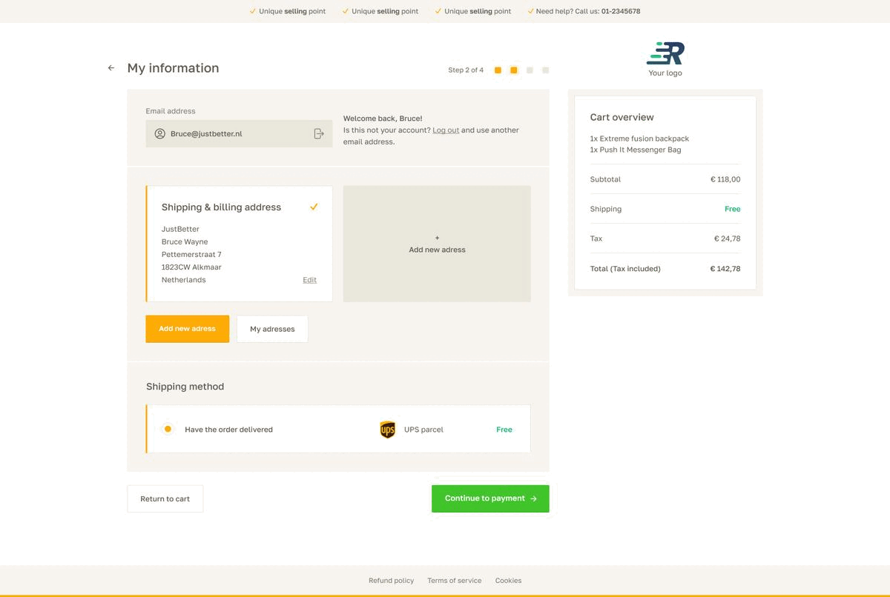

# Rapidez Checkout Theme

An **opinionated** checkout with customer center for [Rapidez](https://github.com/rapidez/rapidez). Easily configurable with your own logo, colors, fonts and style. A fully mobile optimized theme which takes about 1 hour to fully implement.



Package includes:
- Extensive checkout (including a fast checkout experience when users are logged-in)
- Extensive customer center
- Overhaul of the component structure, allowing for limitless control over every part of the checkout theme without hassle

Checkout
- Step 1 - Cart ([image](images/step-1-cart-payment.jpg))
- Step 2 - Shipping information with shipping methods ([logged in](images/step-2-logged-in-my-information.jpg), [logged out](images/step-2-my-information.jpg))
- Step 3 - Payment method ([image](images/step-3-payment.jpg))
- Step 4 - Order success ([image](images/step-4-success.jpg))

Customer center
- Account - Login + Register
- Account - Forgot password + Register
- Account - Register account + Account features + Newsletter subscription (optional)
- Account - Dashboard (My orders, Account settings)
- Account - My orders
- Account - Account settings

Easily configurable in less than 5 minutes
- Colors - Change a total of 8 variables for personal customization
- Logo - Simply add your own logo by extending 1 template
- Visuals - Change the look of various types of cards, customer center tiles, etc, by extending well-defined templates

Fast checkout experience
- Already logged in - If the user is already logged in when entering the checkout, the user enters a simplified step 2 of the checkout.
- Not logged in - If the user is not logged in when entering the checkout, we verify the e-mail that's being used on step 2 of the checkout. If the e-mail is known we provide a login screen where the user can log in to enter the simplified step 2 state.

## Installation

```
composer require rapidez/checkout-theme
```

To use the views from this package instead of the default ones, you'll need to publish the "core overwrite views" with the following command:
```
php artisan vendor:publish --provider="Rapidez\CheckoutTheme\ServiceProvider" --tag=core-overwrites
```

If you've already overwritten these by yourself before you installed this package, you will have to manually overwrite these as the publish command will not overwrite already existing files.

Add these colors to your `tailwind.config.js` and modify them to your liking:
(Alternatively, you could add these to a separate file and add it as a preset to your tailwind.config.js)
```
colors: {
    ct: {
        enhanced: {
            DEFAULT: '#40C42A',
        },
        inactive: {
            DEFAULT: '#8A8275',
            100: '#F6F4EE',
        },
        disabled: '#EBE8DE',
        accent: {
            DEFAULT: '#FEAB05',
        },
        primary: {
            DEFAULT: '#625B50',
        },
        border: '#EAE7DC',
        error: '#DF241D',
    },
},
```

This package also requires the `SKU` functionality to be enabled in the image resizer. This is normally enabled by default.

## Configuration

Publish the configuration file and have a look at the options `config/rapidez/checkout-theme.php`
```
php artisan vendor:publish --provider="Rapidez\CheckoutTheme\ServiceProvider" --tag=config
```

## Payment-icons

Rapidez packages now come with payment icons bundled, and the checkout theme will use these automaticaly. You only have to publish them:
```
php artisan vendor:publish --tag=payment-icons
```

## Customizations

If you want you *could* publish the views. But it's recommended to only publish and change the views you need so when there is an update you don't have to compare all views with the new version. Also keep in mind this is an opinionated theme, if you want/need to change a lot it's better to build your own in terms of upgradability.
```
php artisan vendor:publish --provider="Rapidez\CheckoutTheme\ServiceProvider" --tag=views
```

## License

GNU General Public License v3. Please see [License File](LICENSE) for more information.
